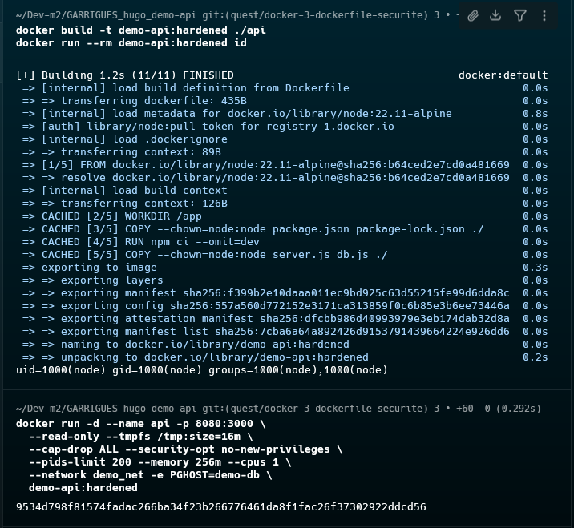
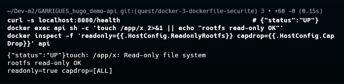

# Quête 3 — Dockerfile et sécurité

## Travail réalisé

J’ai durci `api/Dockerfile` avec `node:22.11-alpine`, l’utilisateur `node`, les copies avec `--chown` et un `HEALTHCHECK` sur `/health`. Le `.dockerignore` exclut les fichiers demandés.


## Build et preuve du compte non-root

`demo_net`, `demo-db` et `api` étaient absents, et le port 8080 était libre. J’ai créé le réseau :

```bash
docker network create demo_net
```

Sortie :

```text
7b7720c0df5fd383cedd52a621d9c6059d3442196e2507c60478edf81dcfa930
```

J’ai construit l’image et vérifié l’utilisateur :

```bash
docker build -t demo-api:hardened ./api
docker run --rm demo-api:hardened id
```

Le build s’est terminé en 1,2 s (11/11 étapes). Sortie de `id` :

```text
uid=1000(node) gid=1000(node) groups=1000(node),1000(node)
```



## Lancement et vérifications

J’ai lancé l’API avec les options demandées. Aucun PostgreSQL n’était nécessaire pour tester `/health`.

```bash
docker run -d --name api -p 8080:3000 \
  --read-only --tmpfs /tmp:size=16m \
  --cap-drop ALL --security-opt no-new-privileges \
  --pids-limit 200 --memory 256m --cpus 1 \
  --network demo_net -e PGHOST=demo-db \
  demo-api:hardened
```

Identifiant retourné : `9534d798f81574fadac266ba34f23b266776461da8f1fac26f37302922ddcd56`.

Vérifications exécutées :

```bash
curl -s localhost:8080/health
docker exec api sh -c 'touch /app/x 2>&1 || echo "rootfs read-only OK"'
docker inspect -f 'readonly={{.HostConfig.ReadonlyRootfs}} capdrop={{.HostConfig.CapDrop}}' api
```

Sorties observées :

```text
{"status":"UP"}
touch: /app/x: Read-only file system
rootfs read-only OK
readonly=true capdrop=[ALL]
```


