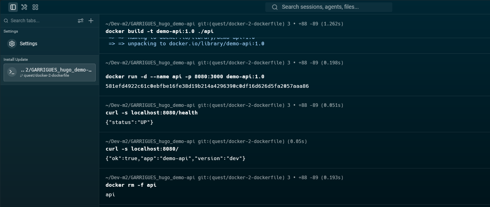
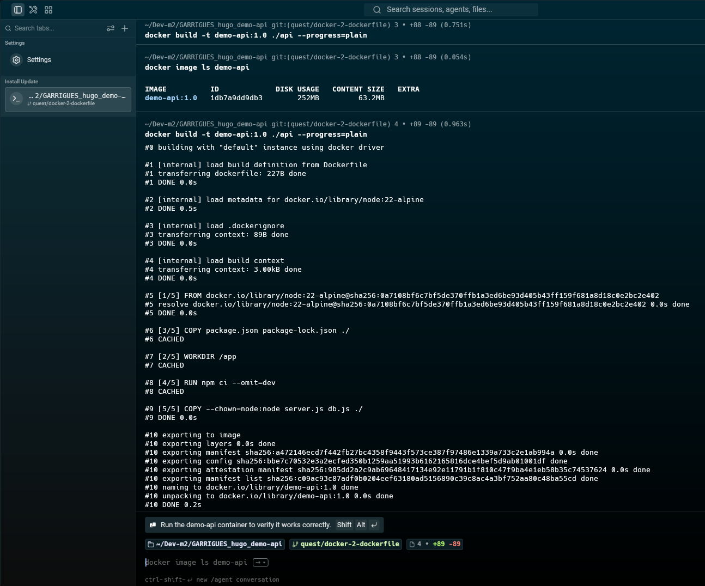
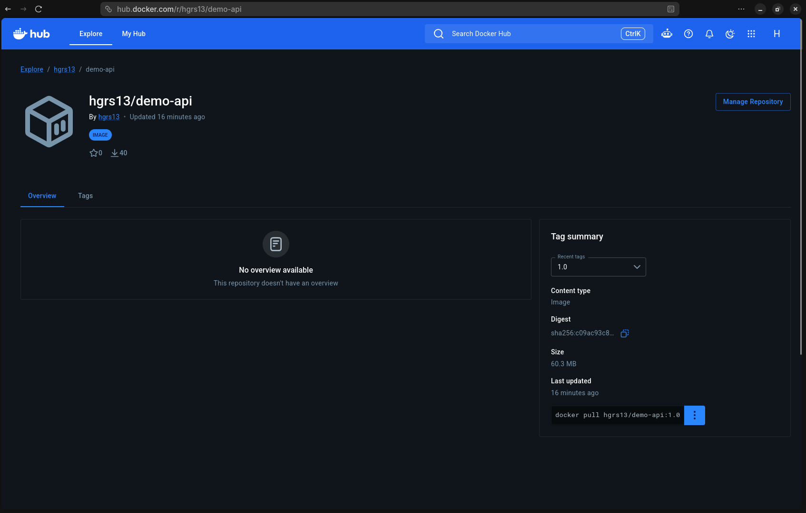

# Quête 2 — Le Dockerfile

## Travail réalisé

J’ai créé `api/Dockerfile` à partir de `node:22-alpine`. Le Dockerfile installe les dépendances dans une couche séparée du code, copie `server.js` et `db.js`, puis lance le serveur avec l’utilisateur non privilégié `node`.

J’ai ajouté `api/.dockerignore` pour exclure notamment `node_modules`, `.git`, les fichiers Markdown et les fichiers d’environnement du contexte de build.

## Construction et tests

Commande de construction :

```bash
docker build --progress=plain -t demo-api:1.0 ./api
```

La construction a terminé avec `DONE` et l’image `demo-api:1.0` a été créée.

J’ai lancé le conteneur avec :

```bash
docker run -d --name api -p 8080:3000 demo-api:1.0
```

Sorties observées lors des tests :

```text
{"status":"UP"}
HTTP 200
{"ok":true,"app":"demo-api","version":"dev"}
HTTP 200
HTTP 503
```

`/health` et `/` répondent en HTTP 200. `/products` répond en HTTP 503, comme prévu sans conteneur PostgreSQL pour cette étape. J’ai supprimé le conteneur avec `docker rm -f api`.



## Preuve du cache

Après avoir modifié temporairement un commentaire dans `api/server.js`, j’ai relancé :

```bash
docker build --progress=plain -t demo-api:1.0 ./api
```

La sortie contient :

```text
#8 [4/5] RUN npm ci --omit=dev
#8 CACHED
#9 [5/5] COPY --chown=node:node server.js db.js ./
#9 DONE 0.0s
```

La copie de `server.js` a été reconstruite, tandis que l’installation des dépendances est restée en cache.



## Image locale

Sortie observée de `docker image ls demo-api` :

```text
IMAGE          ID             DISK USAGE   CONTENT SIZE   EXTRA
demo-api:1.0   c09ac93c87ad        252MB         63.2MB
```

L’utilisateur configuré dans l’image est `node`.

## Liens de publication

- Dépôt GitHub de rendu : à compléter après publication du dépôt de rendu.
- Image Docker Hub : [hgrs13/demo-api:1.0](https://hub.docker.com/r/hgrs13/demo-api).


