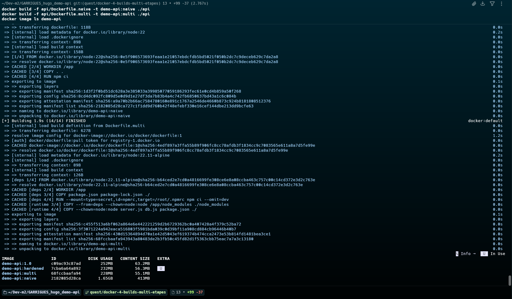
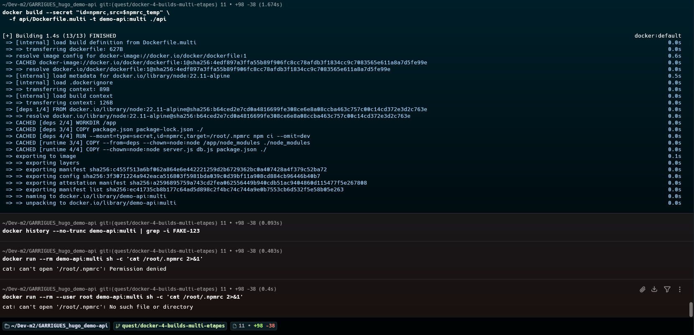

# Quête 4 — Builds multi-étapes et gestion des secrets

## Travail réalisé

J’ai ajouté `api/Dockerfile.naive` comme repère volontairement lourd (`node:22`, copie complète et dépendances de développement) et `api/Dockerfile.multi` avec une étape `deps` et une étape `runtime` sur `node:22.11-alpine`. L’image finale ne reçoit que les dépendances de production et les fichiers nécessaires à l’API. Elle utilise l’utilisateur `node` et vérifie `/health`.

Le Dockerfile de production `api/Dockerfile` est resté intact. Pour la démonstration BuildKit, j’ai temporairement utilisé un faux secret `FAKE-123`, puis restauré la commande normale `npm ci --omit=dev` dans `Dockerfile.multi` et supprimé le fichier temporaire.

## Commandes et vérifications

J’ai construit les deux images et comparé les tailles avec `docker image ls demo-api` :

```bash
docker build -f api/Dockerfile.naive -t demo-api:naive ./api
docker build -f api/Dockerfile.multi -t demo-api:multi ./api
docker image ls demo-api
```

| Image | Disk usage | Content size |
|---|---:|---:|
| `demo-api:naive` (avant) | 1.65 GB | 413 MB |
| `demo-api:multi` (après) | 228 MB | 55.1 MB |

Avec les valeurs affichées, l’image multi-étapes est environ **7,2× plus petite** en disk usage (environ **7,5×** selon le content size). Les tailles sont celles affichées par Docker, arrondies.



Le premier build de démonstration du secret a échoué sur un délai d’accès à Docker Hub. Une nouvelle tentative a réussi :

```bash
docker build --secret id=npmrc,src=/tmp/demo-api-npmrc.OC3Rhv \
  -f api/Dockerfile.multi -t demo-api:multi ./api
```

La commande `docker history --no-trunc demo-api:multi | grep -i 'FAKE-123'` n’a retourné aucune ligne. Pour vérifier le fichier en contournant les permissions de l’utilisateur `node`, j’ai lancé :

```bash
docker run --rm --user root demo-api:multi sh -c 'cat /root/.npmrc 2>&1'
```

Sortie observée :

```text
cat: can't open '/root/.npmrc': No such file or directory
```



Le port 8080 étant libre, j’ai lancé l’image :

```bash
docker run --rm -p 8080:3000 demo-api:multi
```

Puis j’ai vérifié la route :

```bash
curl localhost:8080/health
```

Sortie observée :

```json
{"status":"UP"}
```
