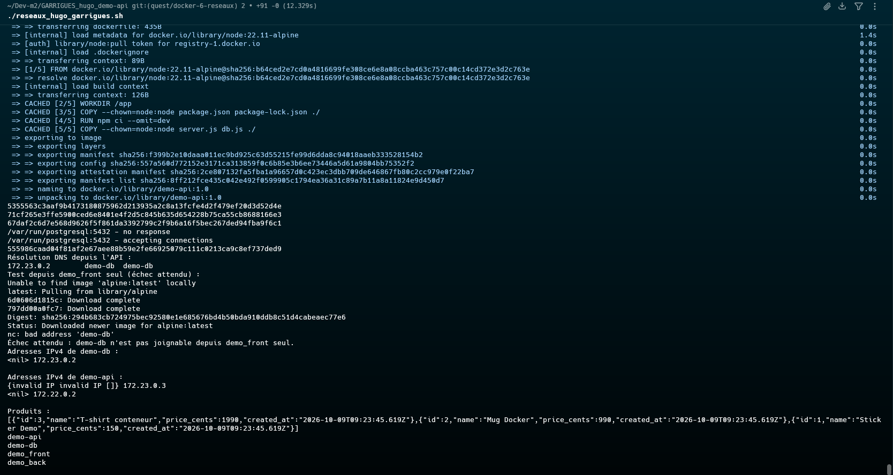

# Quête 6 — Docker : les réseaux

## Travail réalisé

J’ai créé `reseaux_hugo_garrigues.sh` pour lancer `demo-db` sur le réseau `demo_back` et `demo-api` sur `demo_front` et `demo_back`. La base n’a pas de port publié. Le script vérifie la résolution DNS depuis l’API, l’isolation d’un conteneur tiers, les adresses IPv4 et la réponse de `/products`, puis nettoie les conteneurs et les réseaux.

## Commandes et vérifications

Depuis la racine du dépôt, j’ai lancé :

```bash
./reseaux_hugo_garrigues.sh
```

Le build de `demo-api:1.0` a réussi. La base a d’abord affiché `no response`, puis `accepting connections`. Depuis l’API, `demo-db` a été résolu à l’adresse `172.23.0.2` :

```text
Résolution DNS depuis l'API :
172.23.0.2        demo-db  demo-db
```

Le conteneur limité à `demo_front` n’a pas résolu `demo-db`, comme attendu :

```text
nc: bad address 'demo-db'
Échec attendu : demo-db n'est pas joignable depuis demo_front seul.
```

Les adresses affichées par `docker inspect` étaient `172.23.0.2` pour `demo-db`, et `172.23.0.3` et `172.22.0.2` pour `demo-api` sur ses deux réseaux. La requête `curl localhost:8080/products` a renvoyé les trois produits de `db/init.sql` : Sticker Demo, Mug Docker et T-shirt conteneur. Le script a ensuite supprimé les deux conteneurs et les réseaux `demo_front` et `demo_back`.

## Capture d’écran


