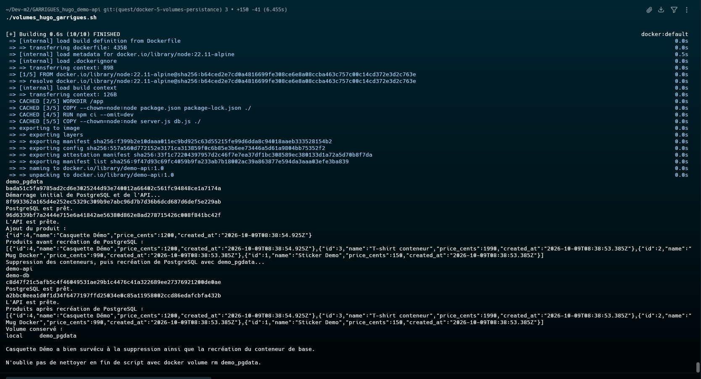

# Quête 5 — Docker : les volumes

## Travail réalisé

J’ai préparé `volumes_hugo_garrigues.sh` pour construire l’image `demo-api:1.0`, créer le volume nommé `demo_pgdata`, démarrer PostgreSQL et l’API sur un réseau Docker commun, puis ajouter « Casquette Démo ». Le script supprime ensuite les conteneurs, recrée PostgreSQL avec le même volume et vérifie que le produit est toujours présent. Il nettoie les conteneurs et le réseau à la fin, tout en conservant le volume pour démontrer la persistance.

## Commandes et vérifications

La page du cours n’était pas accessible. Le challenge et ses critères ci-dessous viennent du texte fourni en pièce jointe.

J’ai exécuté le script le 9 octobre 2026. La construction de `demo-api:1.0` a réussi, PostgreSQL est devenu prêt à deux reprises, et le volume `demo_pgdata` a été conservé après le nettoyage des conteneurs et du réseau.

Depuis la racine du dépôt, dans un terminal ayant accès au daemon Docker :

```bash
bash volumes_hugo_garrigues.sh
```

Sortie observée pour le POST, avant et après la recréation de PostgreSQL, et pour le volume :

```text
{"id":4,"name":"Casquette Démo","price_cents":1200,"created_at":"2026-10-09T08:38:54.925Z"}

Produits avant suppression du conteneur PostgreSQL :
[{"id":4,"name":"Casquette Démo","price_cents":1200,"created_at":"2026-10-09T08:38:54.925Z"},{"id":3,"name":"T-shirt conteneur","price_cents":1990,"created_at":"2026-10-09T08:38:53.385Z"},{"id":2,"name":"Mug Docker","price_cents":990,"created_at":"2026-10-09T08:38:53.385Z"},{"id":1,"name":"Sticker Demo","price_cents":150,"created_at":"2026-10-09T08:38:53.385Z"}]

Produits après recréation du conteneur PostgreSQL :
[{"id":4,"name":"Casquette Démo","price_cents":1200,"created_at":"2026-10-09T08:38:54.925Z"},{"id":3,"name":"T-shirt conteneur","price_cents":1990,"created_at":"2026-10-09T08:38:53.385Z"},{"id":2,"name":"Mug Docker","price_cents":990,"created_at":"2026-10-09T08:38:53.385Z"},{"id":1,"name":"Sticker Demo","price_cents":150,"created_at":"2026-10-09T08:38:53.385Z"}]

Volume conservé pour la preuve :
local     demo_pgdata
```

La dernière requête `curl localhost:8080/products` a renvoyé la même liste après la recréation de la base. Le script a ensuite supprimé `demo-api`, `demo-db` et le réseau; le volume est resté disponible.

Pour supprimer les données après la remise, exécuter manuellement :

```bash
docker volume rm demo_pgdata
```

## Capture d’écran


