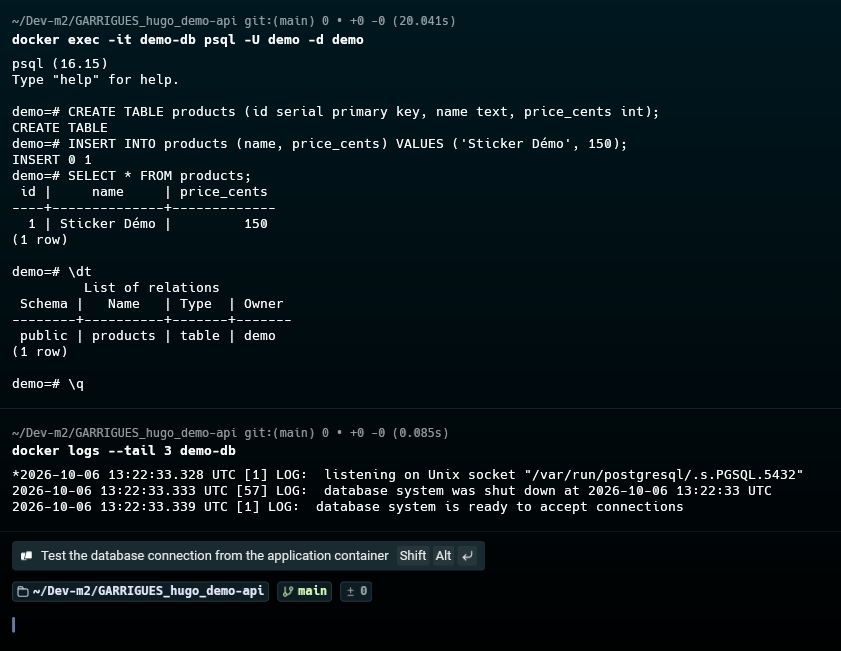

# Quête 1 — Découverte de Docker

**Branche de travail :** `quest/docker-1-decouverte`

Pour cette première quête, j’ai lancé PostgreSQL dans un conteneur Docker. Je me suis ensuite connecté à la base avec `psql`, j’ai créé une table `products` et ajouté un produit. L’exercice m’a permis de manipuler un conteneur et de consulter ses journaux, sans modifier le code de l’API.

## Connexion à la base

J’ai ouvert `psql` directement dans le conteneur avec cette commande :

```bash
docker exec -it demo-db psql -U demo -d demo
```

Une fois dans le client SQL, j’ai créé la table, inséré le produit de démonstration, puis vérifié le résultat :

```text
$ docker exec -it demo-db psql -U demo -d demo
psql (16.15)
Type "help" for help.

demo=# CREATE TABLE products (id serial primary key, name text, price_cents int);
CREATE TABLE
demo=# INSERT INTO products (name, price_cents) VALUES ('Sticker Démo', 150);
INSERT 0 1
demo=# SELECT * FROM products;
 id |     name     | price_cents
----+--------------+-------------
  1 | Sticker Démo |         150
(1 row)

demo=# \dt
         List of relations
 Schema |   Name   | Type  | Owner
--------+----------+-------+-------
 public | products | table | demo
(1 row)

demo=# \q
```

## Vérification du démarrage

J’ai consulté les trois dernières lignes des journaux avec :

```bash
docker logs --tail 3 demo-db
```

La dernière ligne confirme que PostgreSQL est prêt à accepter les connexions :

```text
2026-10-06 13:22:33.328 UTC [1] LOG:  listening on Unix socket "/var/run/postgresql/.s.PGSQL.5432"
2026-10-06 13:22:33.333 UTC [57] LOG:  database system was shut down at 2026-10-06 13:22:33 UTC
2026-10-06 13:22:33.339 UTC [1] LOG:  database system is ready to accept connections
```

## Résultat

La table `products` apparaît bien dans la liste des relations. Elle contient une ligne : le produit `Sticker Démo`, au prix de 150 centimes. Les journaux confirment que la base a démarré correctement.

## Capture d’écran

J’ai conservé cette capture pour montrer la session SQL et les dernières lignes des journaux :



## Pour terminer

Après avoir récupéré les sorties nécessaires au rendu, il faut arrêter puis supprimer le conteneur avec :

```bash
docker stop demo-db && docker rm demo-db
```
